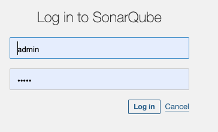
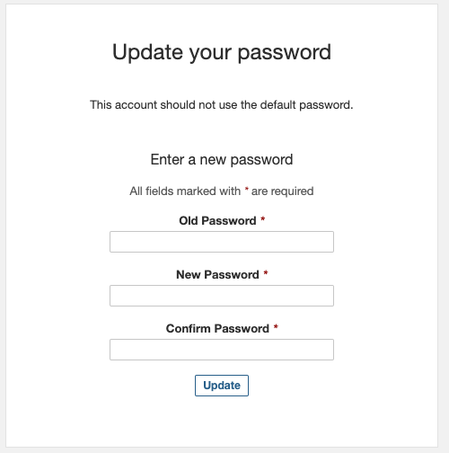
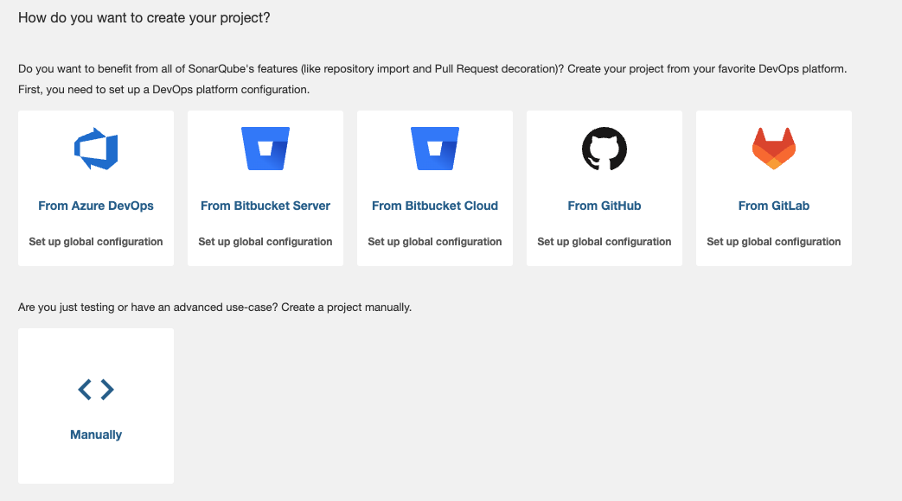
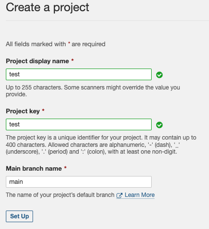
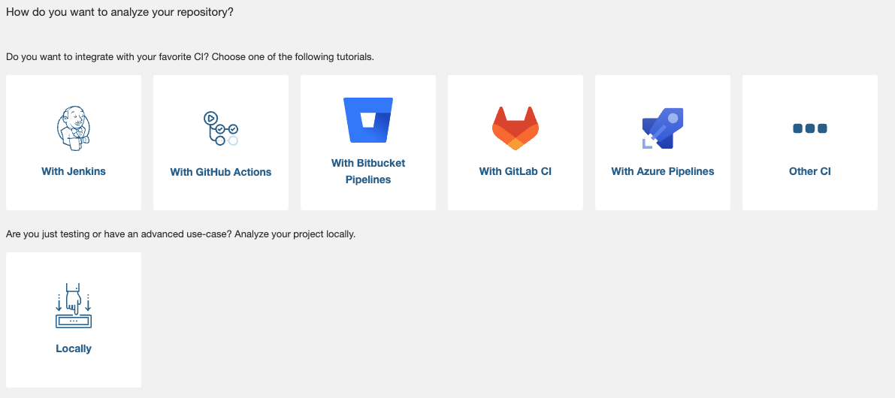
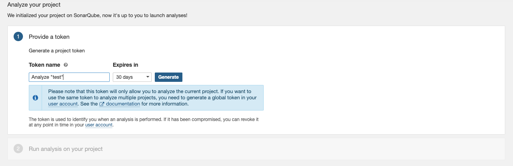
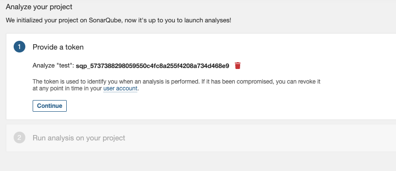
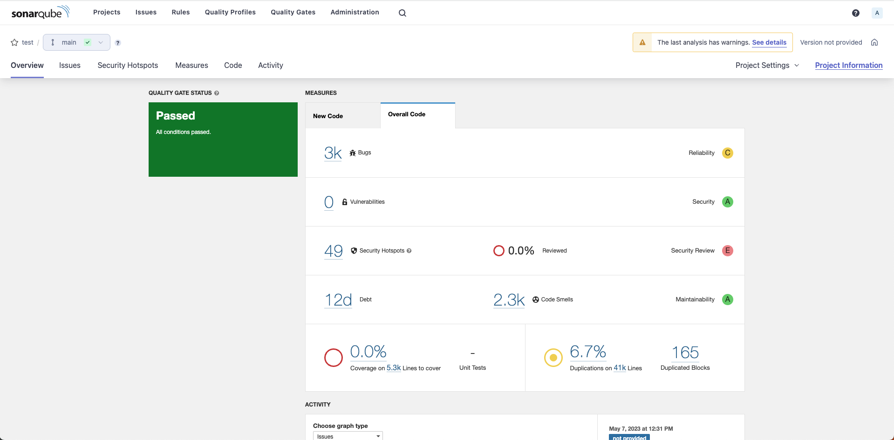

## Prerequisites

You need to install

- docker
- docker-copose 

For MAC
```bash
brew install docker
brew install docker-compose
```

## SonarQube Setup

### First start
```bash
docker-compose up
```
Go to [https:l127.0.0.1:9000](http://localhost:9000/).

#### Password
change the default credential (**admin/admin**) if asked to do. For instance you can use sonar as new password. 


**admin/admin**


**admin/sonar/sonar**


#### New 'test' project
Now it is time to create a 'test' project.
You can select **add a project** or  **new project** to reach the following screen.



Select **Manually** and fill the next form as following




and select to analyze the repository locally



Then click on "generate"



And finally keep not of the TOKEN (ie. sqp_4089e3b40374e096cd9dd7769fa31cf6b04fe1da



you will use in the next step. Click Continue.

## Run

Go to the project folder you want to scan

```bash
cd ${SOURCEPATH}
```
Raplace the TOKEN witht he one generated at the previous setup step 

```bash
docker run --rm --network="host" -v "$(pwd):/data" noenv/sonar-scanner sonar-scanner -D sonar.projectKey=test -D sonar.host.url=http://127.0.0.1:9000 -D sonar.login=TOKEN -D sonar.language=php -D sonar.sources=.
```

Exmaple if the TOKEN is sqp_4089e3b40374e096cd9dd7769fa31cf6b04fe1da
you need to run form the source folder the following  
```bash
docker run --rm --network="host" -v "$(pwd):/data" noenv/sonar-scanner sonar-scanner -D sonar.projectKey=test -D sonar.host.url=http://127.0.0.1:9000 -D sonar.login=sqp_5737388298059550c4fc8a255f4208a734d468e9 -D sonar.language=php -D sonar.sources=.
```

## Results



